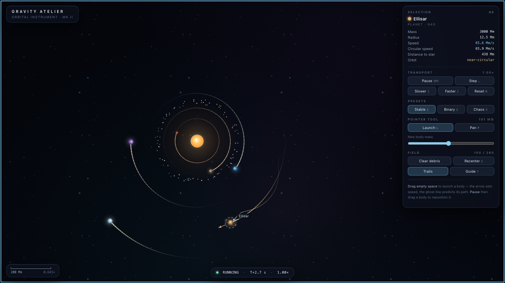

# Gravity Atelier

A direct-open orbital sandbox. Open `index.html` in any modern browser — no server, no build
step, no dependencies, no network access of any kind. Canvas 2D and ordinary browser APIs only.

A star and six planets are already in motion when the page paints. Drag on empty space to fling a
new world into the system and watch whether it settles into an orbit, gets slingshot away, or
falls in.



---

## Controls

| Action | Input |
| --- | --- |
| Launch a new body | Drag on empty space — drag *away* from where you want it, slingshot style |
| Pan the view | Shift-drag, right-drag, middle-drag, or arrow keys |
| Zoom at the pointer | Wheel / trackpad, or <kbd>+</kbd> <kbd>−</kbd> |
| Inspect a body | Click it |
| Reposition a body | Pause first, then drag it |
| Pause / resume | <kbd>Space</kbd> |
| Single step | <kbd>.</kbd> |
| Time scale | <kbd>[</kbd> <kbd>]</kbd> — 0.1× to 8× |
| Restore the current preset | <kbd>R</kbd> |
| Presets | <kbd>1</kbd> stable · <kbd>2</kbd> binary · <kbd>3</kbd> chaos |
| Launch / Pan pointer tool | <kbd>L</kbd> <kbd>P</kbd> |
| Recenter on the system | <kbd>C</kbd> |
| Clear debris | <kbd>D</kbd> |
| Toggle trails | <kbd>T</kbd> |
| Deselect | <kbd>Esc</kbd> |
| This guide | <kbd>?</kbd> or <kbd>H</kbd> |

While you drag to launch, a live arrow shows the departure velocity, a read-out shows the speed and
mass, and a dashed curve predicts where the body will actually go. The **Launch / Pan** toggle sets
what a plain left-drag does; holding <kbd>Shift</kbd> always does the other one.

Everything is reachable by keyboard. <kbd>Tab</kbd> moves into the instrument panel, focus is always
visibly outlined, and the selected body's telemetry is mirrored into an ARIA live region.

---

## Units

The simulation is not in SI units. It uses a set chosen so the numbers on screen stay readable and
several orbits fit inside a thirty-second look:

| Quantity | Unit | Note |
| --- | --- | --- |
| Mass | Earth masses (M⊕) | Sun = 333,000 M⊕; the panel switches to M☉ above 10⁵ |
| Length | "megametres" (Mm) | A label for world units, not a real physical scale |
| Time | seconds | 1 s of simulated time per real second at 1× |
| G | 5.706 | Tuned, not measured |

With those numbers a body at r = 108 orbits in about 5.3 s and one at r = 580 in about 66 s, so the
inner system visibly turns while the outer system stays legible.

---

## Physics

### Integrator

Fixed step of **1/120 s**, integrated with **velocity Verlet**:

```
x += v·dt + ½·a·dt²
a' = accel(x)
v += ½·(a + a')·dt
```

Velocity Verlet is symplectic, so it does not systematically pump energy into or out of an orbit
the way explicit Euler does. A circular two-body orbit closes on itself to within **0.16 %** of its
radius after a full period at this step size (`tools/check-physics.mjs` asserts < 2 %).

Wall-clock time is fed through an accumulator, so the physics step never depends on frame rate. The
frame delta is clamped to 1/20 s and no more than 48 steps run per frame, which means a tab that has
been in the background for a minute resumes smoothly instead of trying to simulate the whole minute
in one frame. Time scale multiplies how much simulated time is banked per real second; it never
changes `dt`.

### Softening

Pair acceleration uses a Plummer-style softened kernel:

```
a   = G·m / (d² + ε²)^(3/2) · d⃗
ε   = max(1.6, 0.5 · min(rₐ, r_b))
```

Two choices worth explaining:

- **ε is tied to the smaller radius, not the sum.** Collisions already fire at `d < rₐ + r_b`, so
  the kernel never has to survive a true `d → 0` approach between solid bodies. Sizing ε off the
  *sum* means a large star's own radius weakens its planets' orbits by around 1 %, which is small
  enough to look fine and large enough to be badly wrong: an early build did exactly this and the
  test orbit came back **22 %** off after one period. With `min()`, the softening term is ~10⁻⁴ of
  the force at ordinary orbital separations and still bounded at contact.
- **An absolute floor of 1.6.** Two coincident zero-radius fragments produce a finite, small
  acceleration instead of a division by zero.

Belt-and-braces beyond that: acceleration is hard-clamped at 90,000 and speed at 6,000 per step, and
any body that reaches 26,000 units from the origin, or goes non-finite, is culled. A point mass
fired dead through the centre of a star — the worst case for an unsoftened kernel — peaks at about
1,300 and stays finite.

### Collisions

Contact is detected in the same O(n²) pass that accumulates gravity, so there is no second sweep and
nothing is allocated per frame. Two outcomes, both exactly momentum-conserving:

**Merge.** The pair becomes one body of mass `mₐ + m_b` at their centre of mass, moving at
`(mₐvₐ + m_bv_b) / (mₐ + m_b)`. Radius is recomputed from the combined mass. A shock ring is emitted.

**Fragmentation.** Above a relative impact speed of 190, and when both bodies carry enough mass for
the shards to be worth drawing, the impact shatters instead. A core keeps 74 % of the mass; the rest
leaves as 7 shards fired around the contact normal. The core's velocity is then *solved* rather than
assumed:

```
v_core = (p_total − Σ mᵢvᵢ) / m_core
```

so total momentum is conserved to floating-point precision no matter which way the shards happen to
scatter. Measured drift through a fragmenting impact is ~10⁻¹⁶ relative.

**Debris does not collide with other debris.** A belt drawn in 2D is a projection of a 3D torus;
grain-on-grain contact in the flattened view is an artifact of that projection, not physics. Without
this exclusion a 92-grain belt erodes into a handful of lumps — and emits a steady stream of shock
rings — within a minute. Debris is still fully collidable with, and accreted by, planets and stars,
which is where the momentum bookkeeping and the visual payoff actually live.

### Limits

- Maximum 260 bodies. At the cap, the lightest non-star body is dropped to make room.
- **Clear debris** removes only bodies classified as debris — collision shards, belt dust, and
  anything you launched below 45 M⊕. It is deliberately keyed on *kind* rather than on mass, so a
  genuinely small planet (Mercury is 3.1 M⊕, well under the threshold) is never swept away.

### Determinism

A seeded mulberry32 generator drives every preset; `Math.random` is never used for simulation state.
Same seed ⇒ bit-identical system, and pressing <kbd>R</kbd> twice reproduces the same layout exactly.
`tools/check-physics.mjs` verifies that all three presets stay bit-identical after 10 s of stepping.

---

## The presets

**1 — Stable.** A sun-like primary, six planets, a super-Jupiter with a moon, and a 92-grain
asteroid belt. Orbits are spaced at roughly 1.9+ mutual Hill radii; the moon sits at about a third
of the giant's Hill radius (at 0.45 the star pumps its eccentricity until the periapsis reaches the
giant's surface after roughly a minute — this was measured, not guessed). All eight major bodies
survive 60 s with under 11 % drift in orbital radius, and the belt loses no grains over 120 s.

**2 — Binary.** Two stars on a mutual circular orbit, an S-type companion around the primary at 0.25
of the pair separation, two circumbinary planets outside the 2.4× stability limit, and a dust halo.
The pair's separation holds to within 1 % over 60 s.

**3 — Chaos.** Four heavy giants packed at roughly 1.2 mutual Hill radii, ten light bodies on
eccentric orbits, and an unbound interloper that rakes through a few seconds in. It is genuinely
unstable, but it unwinds *gradually* — nothing is lost in the first 5 s, and around 8 bodies remain
at 30 s and 6 at 60 s, through ten or so slingshots, mergers and ejections.

### Belt placement

A planet clears a chaotic zone of roughly ±3.5 Hill radii around its own orbit — far wider than the
Hill radius itself. An earlier build placed the belt 30 units from a neighbour, comfortably outside
that planet's Hill radius, and it looked fine for thirty seconds before the planet started eating a
grain every few seconds. The belt now sits at 184–208, outside both neighbours' chaotic zones, and
is stable indefinitely.

---

## Engineering notes

- **Simulation and rendering are separate.** The `World` / `Body` classes hold no DOM, canvas or
  colour-resolution logic; the renderer only reads them. The whole core is evaluated headlessly in
  Node by the physics check, with no stubbing.
- **Resize does not distort orbits.** The camera stores the *world point at the centre of the
  viewport* plus a uniform scale, so changing the window re-frames the scene without ever scaling
  or shearing simulation coordinates.
- **No large per-frame allocation.** Trails are fixed-size `Float32Array` ring buffers sized at
  construction; collision pairs reuse one scratch array; shock rings come from a pool; the starfield
  is three pre-rendered tiles drawn as repeating patterns.
- **Verlet hand-off across a changed body set.** Velocity Verlet carries acceleration across the
  step boundary. When a merge removes a body, the survivor's stored acceleration was computed
  against a partner that no longer exists, and its equal-and-opposite term is gone — so the next
  half-kick silently injects momentum. (Measured: a single merge leaked about 1.5 % of total
  momentum one step *after* the collision.) Accelerations are now recomputed whenever the body set
  changes, which costs one extra O(n²) pass on those rare steps and makes the hand-off exact.
- **Reduced motion.** `prefers-reduced-motion` shortens trails to 35 % and damps collision flashes
  and the animated selection dash, while leaving orbital motion completely intact.

### Deliberate trade-offs

- **O(n²) gravity, no Barnes–Hut.** At a 260-body cap that is about 34,000 pairs per step, which is
  comfortable, and an exact all-pairs force keeps slingshots and resonances honest. A tree code
  would be faster and less accurate for no benefit at this scale.
- **The trajectory preview holds the other bodies fixed.** It integrates a test particle through the
  current field rather than cloning and running the whole system. That is exact for the dominant
  stellar term over a short horizon, wrong in detail if you aim straight at a fast-moving planet,
  and cheap enough to recompute inside a `pointermove` handler.
- **Trails are drawn in 6-point chunks**, each with its own colour and alpha, rather than one stroke
  per segment. Per-segment strokes would be ~1,700 draw calls a frame; chunking cuts that by 6×
  while keeping the velocity gradient readable.
- **Trail colour encodes speed relative to the local circular speed**, not raw pixels per second, so
  "hot" consistently means "moving faster than a circular orbit here" at every distance from the
  star.
- **Belt dust carries no trail.** Dozens of short isolated streaks read as scratches on the glass.
  Collision fragments *do* keep a short trail, because that streak is what makes an impact legible.

---

## Verification

Two check suites, both runnable offline with only Node and (for the second) a local Chrome.

```
node tools/check-physics.mjs    # 15 checks — headless simulation core
node tools/check-render.mjs     # 21 checks — real browser, real input events
```

`tools/check-physics.mjs` extracts the inline script from `index.html` and evaluates it in a
`node:vm` context with no DOM, so it exercises the *shipped* code rather than a copy. It covers RNG
determinism, preset reproducibility, integrator accuracy, momentum conservation under gravity and
through both collision paths, the post-collision Verlet hand-off, softening bounds, the body cap,
the debris rule, trail buffer stability, and the long-run behaviour of all three presets.

`tools/check-render.mjs` drives the real page in a local headless Chrome over the DevTools protocol
(using Node's built-in `WebSocket` and `fetch` — nothing is installed, and the only connection is
loopback to a browser the script itself launched). It walks the entire acceptance checklist with
trusted input events: boot time, drag-to-launch, click-to-inspect, wheel zoom anchoring, shift-drag
pan, pause/step/resume, drag-while-paused, time scale, reset determinism, all three presets, live
collision momentum, clear-debris, background-tab clamping, reduced motion, keyboard focus, absence
of remote references, and console cleanliness across twelve seconds of unattended play. It writes
`screenshot.png` at the end. Chrome runs from a throwaway profile inside this directory and is
killed before the process exits.

Set `GALLERY=<dir>` to also capture the other presets, the launch preview and the help overlay.

To support the browser suite, `index.html` publishes a small read-mostly handle at
`window.GravityAtelier.instance`. The app never depends on it existing.
